해당 제작기는 독자가 핸드와이어링으로 키보드를 만든 적이 있음을 상정하고 해당 부분은 건너뛰었습니다. 전체 내용은 작성자가 ZMK로 키보드를 빌드한 경험이 없어서 헤멘 경험을 바탕으로 같은 조건에 있는 사람들을 돕기 위해 작성되었습니다.  
   
## 계획하기
이 키보드를 만들기로 결정하면서 가장 우선적으로 달성하고자 한 목표는 정전식 터치 센서를 사용해서 마우스 레이어로 자동으로 전환하게 만드는 것이었습니다.  
ZMK 디스코드에서 ufan 이라는 사용자가 스테인레스 볼 베어링을 써서 구현한 것을 본 적이 있기 때문에 이게 가능하다는 걸 알았고, 그래서 저도 자연스럽게 스테인레스 베어링을 쓰기로 결정했습니다.  
일단 쇠공을 트랙볼로 쓰는 게 결정되었으니, 저는 목재와 금속을 같이 쓰면 뭔가 빈티지 목공예품 느낌으로 인상적인 디자인이 나올 거 같았어요.   
그래서 비록 제작 도중에 정전식 터치가 굳이 필요가 없다는 걸 배워서 해당 기능은 포기했으나, 디자인 방향 자체는 마음에 들어서 계속 진행하기로 했습니다.  
  
기능 면에 있어서는 저는 키보드가 무선으로 동작하고, 버튼 스위치로 켜고 끌 수 있게 만들어서 배터리를 절약하고, 텐트에 자석을 달아서 탈부착하기 쉽게 만들며, nice!view 디스플레이를 달아서 스플릿 연결 상태와 배터리 잔량을 쉽게 알 수 있도록 만들고자 했습니다.  
처음 세 목표는 달성이 가능하다는 걸 알았지만 제작 시점에서는 트랙볼과 디스플레이를 동시에 사용하는 사람을 본 적이 없고 ZMK에서 마우스 기능은 제한적이라서 불확실했습니다.  
앞으로 키보드를 만들기 위해 뭘 해야 할 지 확실해지자 저는 제작 단계로 넘어갔습니다.  
  
제작할 때 유튜브 채널 [EIGAtech의 무선 카리브디스 키보드 제작 영상,](https://www.youtube.com/watch?v=Mks7QDxFreY&t)이 크게 도움이 되었고, 관심이 있으신 분께서는 이를 시청하실 것을 권고합니다.  

## 모델링
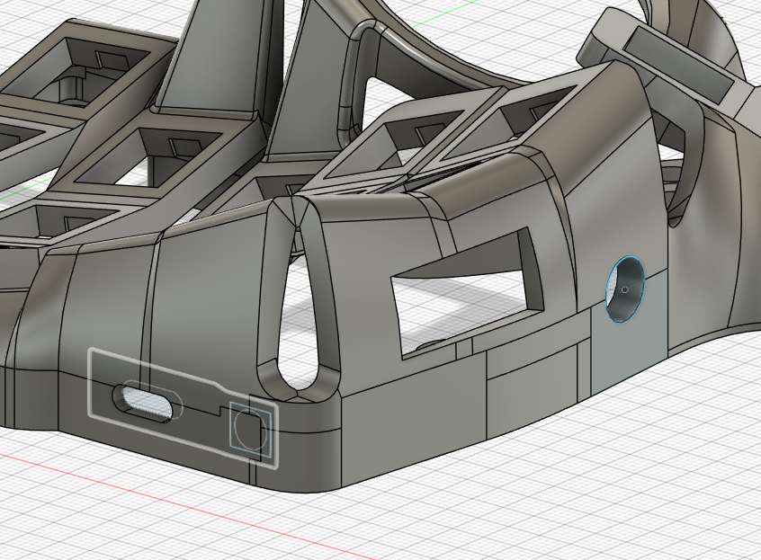  
저는 퓨전360 기능을 거의 모르지만 어차피 제가 수정하는 거는 매우 간단한 것들에 불과해서 제작 과정이 크게 지체되지 않았습니다.  
처음에는 케이스 옆면에 버튼 스위치가 들어갈 구멍을 하나 뚫고, 앞면에 TRRS 커넥터가 꽂히는 구멍을 메웠습니다.  
핸드와이어링할 때 쓰는 MCU 홀더도 모양을 좀 수정해서 TRRS 커넥터 지탱하는 부분을 없애고, 밀맥스 소켓을 꽂을 수 있게 만들고, 3x6 리셋 버튼을 쓰게 만들었습니다.  
여기까지는 다 쉬웠는데, 이제 nice!view 를 다는 곳을 만들려 하다 보니 애초에 이걸 붙잡을 수 있는 벽 자체가 없었습니다.  
그래서 원 제작자인 [BastardKB가 키보드 디자인 과정을 보여주는 유튜브 영상을](https://youtu.be/scoX8NZv4MI?si=uietOpE2jdQoaGku&t=1031) 참고해서 똑같은 방법으로 측면에 벽을 만들었고, 그 다음에 사각형 모양 구멍을 뚫어서 nice!view가 딱 맞게 들어가도록 만들었어요.  
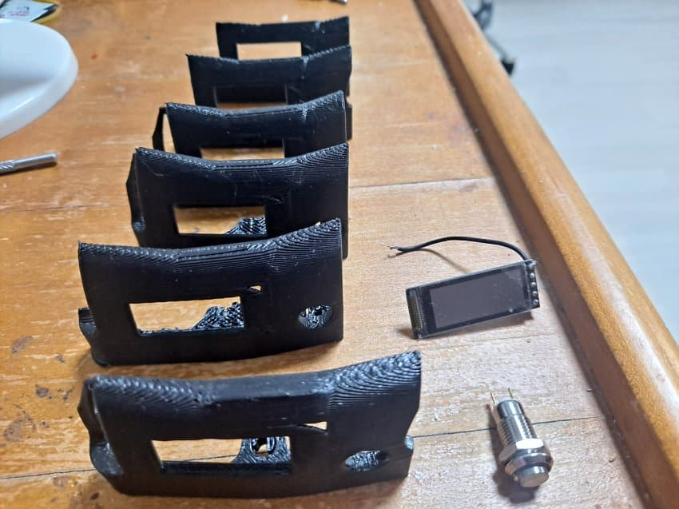  
만약 제가 퓨전을 제대로 쓸 줄 알았다면 무슨 걸쇠나 기타 지지 부품을 만들어서 nice!view가 제자리에 고정되게 만들었을 건데  
저는 제가 뭘 하는지도 잘 모르는 상태였기 때문에 그냥 여기서 멈추고 글루건 써서 고정하기로 했습니다.    
  
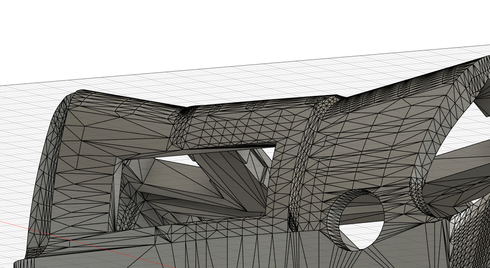  
  
스켈레틸 케이스는 벽 부분이 위쪽으로 돌출되는 결함을 지녔습니다.  
제 능력으로는 이걸 고칠 수가 없어서 그냥 3D프린팅을 한 뒤 사포로 갈아서 없앴습니다.  
  
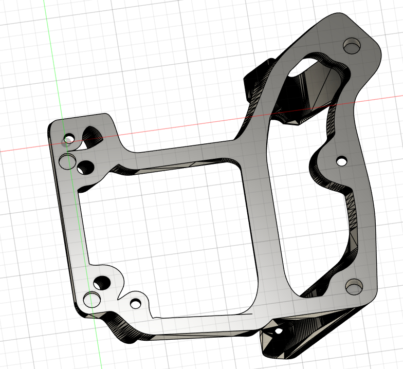  
키보드 텐트에도 지름이 6cm인 자석을 달 수 있게 구멍을 네 개 뚫었습니다.  
앞쪽은 3x6 자석을 두 개씩 넣을 수 있을 정도로 높았고, 뒤쪽은 높이가 워낙 낮아서 2x6 자석을 하나씩만 겨우 넣을 수 있었습니다.  
자석을 이 정도로는 써야 키보드가 미끄러지지 않고 제자리에 고정되었습니다.  
  
## 3D 프린팅, 사포질, 우드 스테이닝
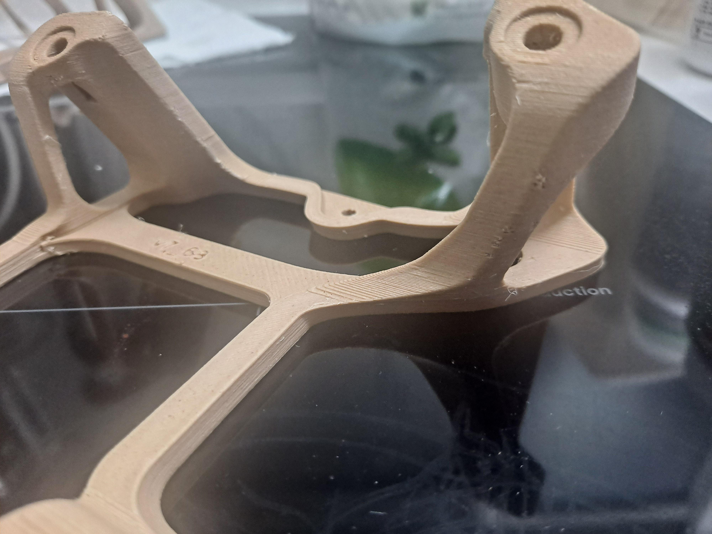  
모델링 단계가 끝난 뒤 저는 우드 PLA 필라멘트를 써서 케이스와 텐트를 프린팅했습니다.  
우드 필라멘트를 쓴 이유는 키보드를 최대한 진짜 목공예품처럼 느껴지게 하고 싶어서 그랬고, 온라인에서 찾아보니 우드 필라멘트를 사포질하고 스테이닝 하는 게 좋은 결과를 가져온다는 글을 찾았기 때문입니다.  
허나 제작 도중에 그냥 일반 필라멘트로 뽑은 뒤 나무 느낌으로 도색하는 거가 훨씬 절차가 쉽고, 더 세세적으로 조절하기 편하며, 결과물도 더 좋다는 걸 배웠습니다.  
만약 제가 이 키보드를 다시 만든다면 그때는 그냥 일반 필라멘트로 도색을 할 것 같습니다.  
  
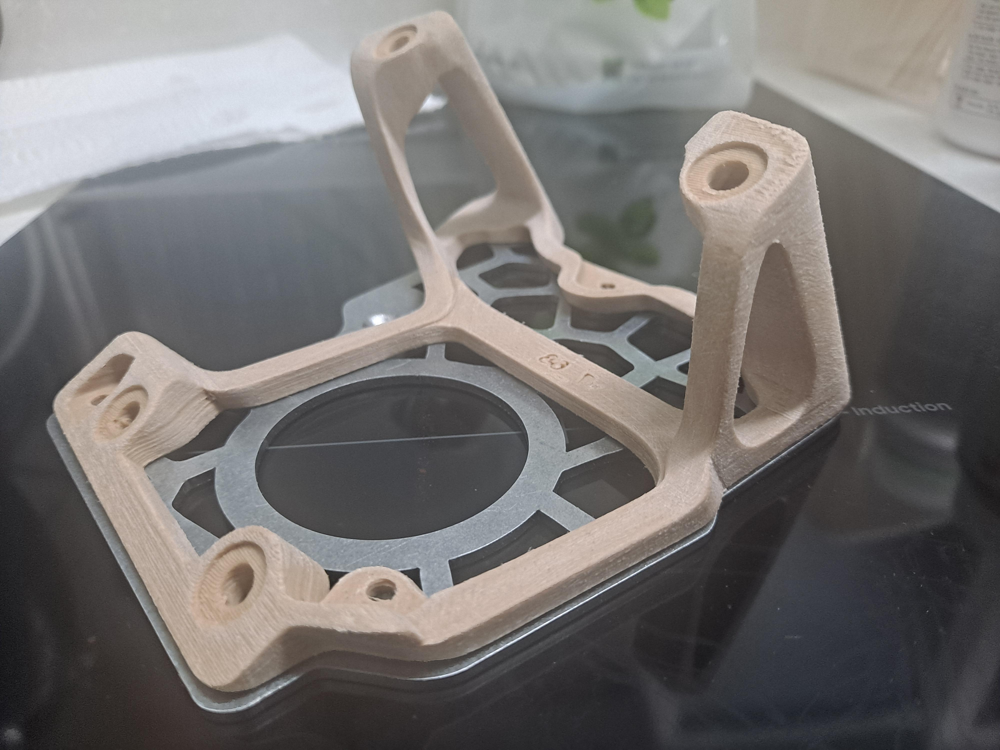  
저는 80방 사포를 써서 키보드 표면을 사포질해서 우드 스테인을 더 잘 흡수할 수 있게 만들었습니다.  
이때 160방이나 200방을 쓸 수도 있는데, 저는 80방 쓰는 게 전체 사포질 과정을 단축시키고, 원래의 미끈하고 층층이 쌓인 3D프린팅 표면보다 더 거칠고 자연스러운 나무 느낌을 내는 것을 기대했습니다.  
또한 사포질하면서 계단현상이 안 보이게 표면을 최대한 미끈하게 만들었습니다.  
  
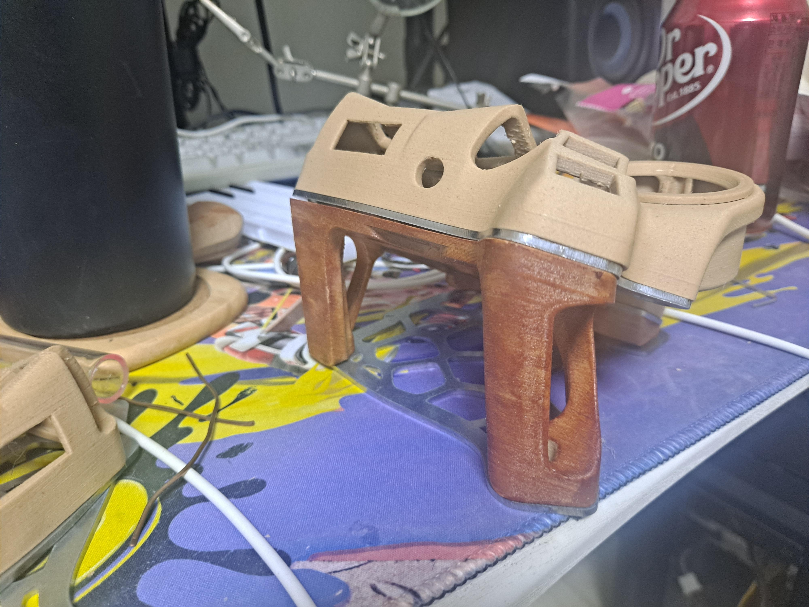  
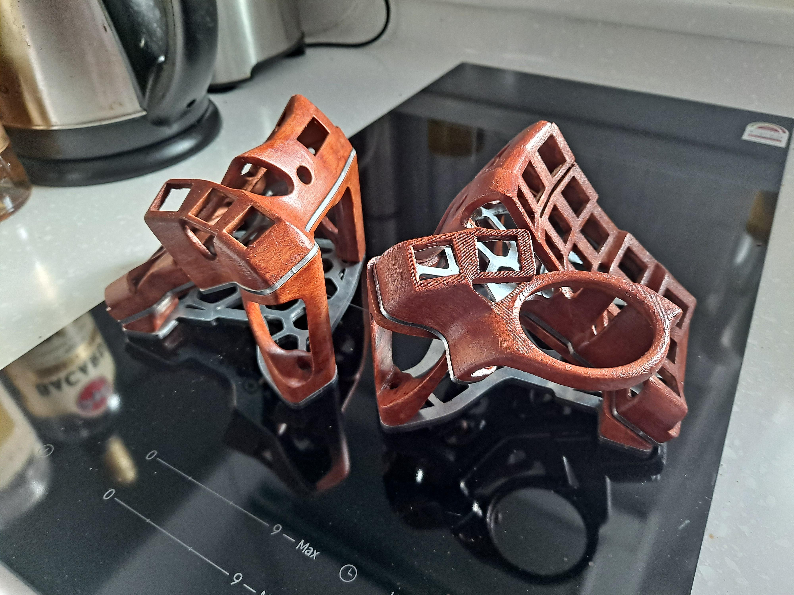  
키보드 케이스와 텐트를 전부 사포질한 뒤, 대충 싸구려 우드 스테인으로 두 세 번 정도 코팅해서 칠하고 무광 바니쉬를 마무리로 발라줬습니다.  
최종 결과물은 제가 원했던 것보다 너무 밝은 붉은색이 되었지만 그럭저럭 받아들일 만해서 다음 단계로 넘어갔습니다.  

## 와이어링과 펌웨어
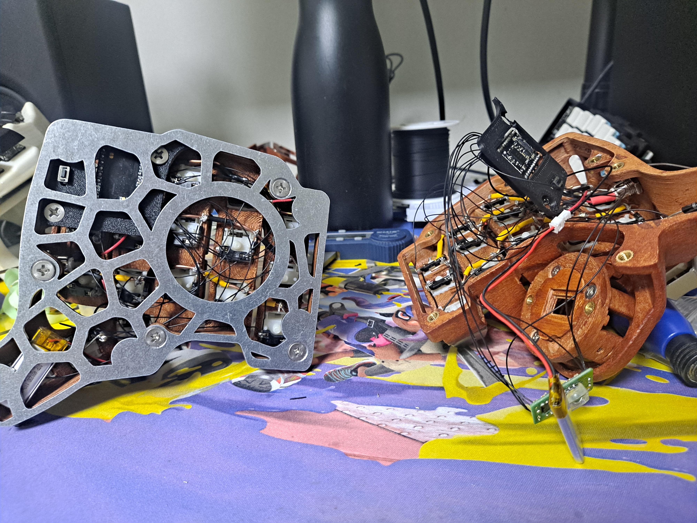  
저는 이 키보드를 핸드와이어링으로 만들었는데, 그 이유는 마침 집에 재료가 다 있었고 돈을 아끼고 싶었기 때문입니다. 이 결정은 나중에 가서 깊이 후회하게 되었는데, 왜냐하면 카리브디스 나노 키보드는 높이가 엄청 낮아서 내부의 전선이랑 핫스왑 소켓이 철판 밑에 있는 바닥에 닿아서 자칫하면 쇼트를 낼 수 있기 때문입니다. 이런 이유로 만약 카리브디스 나노를 제작할 거면 플렉서블 PCB를 쓸 것을 강력하게 권고합니다.  
저는 ZMK 펌웨어를 코딩하는 법을 거의 모르기 때문에 이미 존재하는 펌웨어를 막 뒤져가며 대충 어떻게 돌아가는 거구나 하고 추측을 하는 게 전부였습니다. 키보드를 핸드와이어링하는 게 그래서 엄청 큰 문제가 되었는데, 얘는 제가 MCU에서 어떤 핀에다 전선을 연결하는지 모르니까 PCB 연결하듯 그냥 대충 만들고선 펌웨어 설치하는 식으로 편하게 제작할 수 없기 때문이에요.  
그래서 만약 이 키보드를 만들 거라면 플렉서블 PCB와 함께 이미 펌웨어에 맞춰서 모든 핀이 다 제대로 설정이 된  [VOID가 만든 nice!nano 홀더를](https://github.com/victorlucachi/Elite-C-holder) 쓰는 게 좋습니다.  
저는 어떤 핀에 와이어링을 해야 하는지 알아내기 위해 [EIGAtech 의 ZMK 펌웨어에](https://github.com/eigatech/zmk-config/tree/charybdis) 들어가서 파일을 전부 뒤져봤고, 그 결과 중요 파일 세 개를 찾았습니다.  

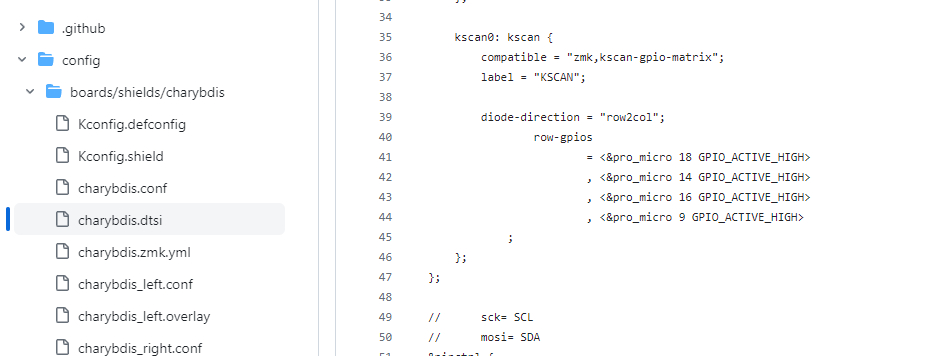  
  
charybdis.dsti : 이 파일 내에서는 row2col 와 row-gpios 을 찾아 볼 수 있습니다. 
row2col 은 무슨 뜻이냐면 키보드 매트릭스를 스캔할 때 전류가 행에서 출발해서 열로 나간다는 뜻입니다.  
이는 매우 중요한 디테일인데, 전류가 어떤 방향으로 흐르는지 알아야 다이오드를 올바른 방향으로 납땜해서 전류가 반대 방향으로 안 흐르고 정상적으로 작동하게 만들 수 있습니다.  
row-gpios 는 어떤 행이 어떤 핀에 연결되는지 보여줘서 저거에 맞게 와이어링을 하면 됩니다.  
아니면 굳이 똑같은 핀에 고집할 필요 없이 핀 번호를 수정해서 딴 핀에 와이어링하게 만들 수도 있어요.  
이건 일부 예외를 제외하고 모든 핀에 적용되는 사항이니 알아두는 것이 좋습니다.  
  
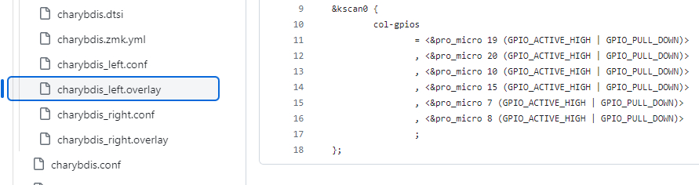  
  
charybdis_left.overlay : 여기서는 col-gpios 를 찾아냈는데, 얘는 어떤 열을 와이어링해야 하는지 보여줘요.  
이때 한 가지 문제가 있었는데, 이 펌웨어는 3x6 배열인 카리브디스 미니 용으로 제작되었는데 문제는 제가 만드는 건 3x5 배열인 카리브디스 나노라는 겁니다.  
즉 이 키보드에는 제가 사용하지 않는 열이 하나 존재하나, 그게 정확히 몇번 열인지를 펌웨어만 보고서는 알 방법이 없었습니다.  
이를 해결하기 위해 저는 일단 2번열을 핀에 연결한 다음에 눌러서 얘의 상대적인 위치를 파악했고, 그래서 키보드에 1번열이 없는 건지 6번열이 없는 건지 확인했습니다.  
1번열이 없는 거였고, 그래서 이 핀은 아무것도 연결하지 않았어요.  
  
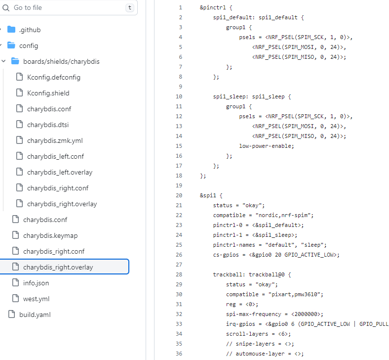  
  
charybdis_right.overlay : 여기서는 &pinctrl 하고 &spi1 을 찾았습니다. 얘네는 트랙볼 센서를 어떻게 연결해야 하는지 알려줬어요.  

이제 키보드에 nice!view를 달기만 하면 되어서 온라인에 딴 사람들 ZMK 펌웨어를 찾아봐서 이걸 어떻게 추가하는 건지 알아봤습니다.  
  
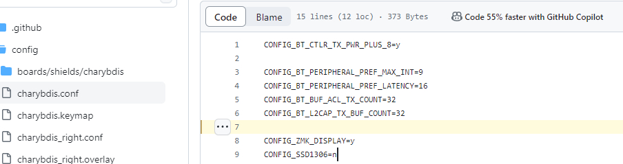  
  
Charybdis.conf 파일에는 위에 보이는 대로 CONFIG_ZMK_DISPLAY=y and CONFIG_SSD1306=n 를 추가해야 합니다.  
  
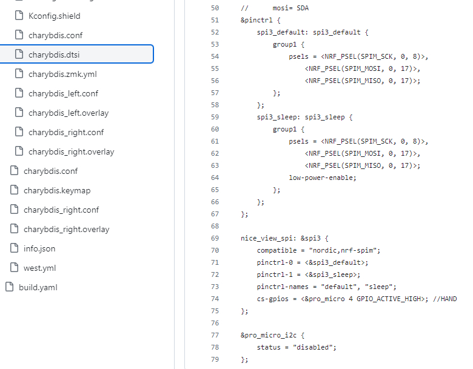  
  
charybdis.dtsi 파일에는 &pinctrl 이랑 nice_view_spi 섹션 전체를 위에 보이는 대로 추가해야 합니다.  
  
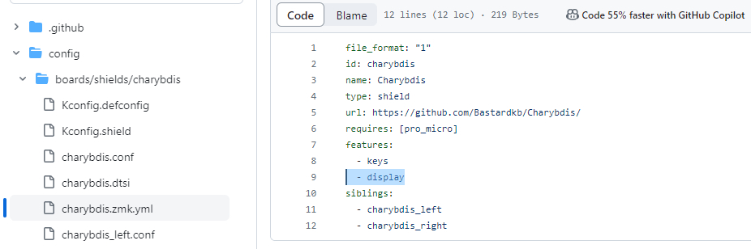  
  
charybdis.zmk.yml 에는 features 라고 쓰인 거 밑에 - display 라고 추가해야 합니다.  
  
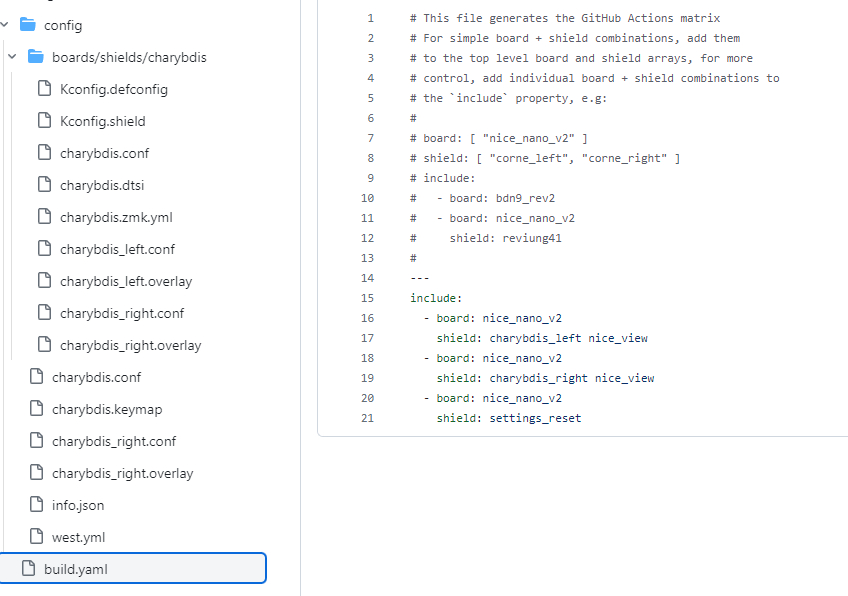  

그리고 이게 가장 중요한 부분인데, build.yami 파일에는 nice_view 라는 문구를 shield: charybdis_left 하고 shield: charybdis_right 둘 다 뒤쪽에다 붙여써야 합니다.  
요 설정들을 전부 다 해야 nice!view가 작동하는 건지 아닌지는 모르겠는데, 적어도 저는 저걸 다 한 상태에서 nice!view 가 정상 작동했습니다.  
여기서 키보드 이름은 꼭 charybdis 일 필요가 없고 자기 키보드 이름을 쓰기만 하면 됩니다.  
  
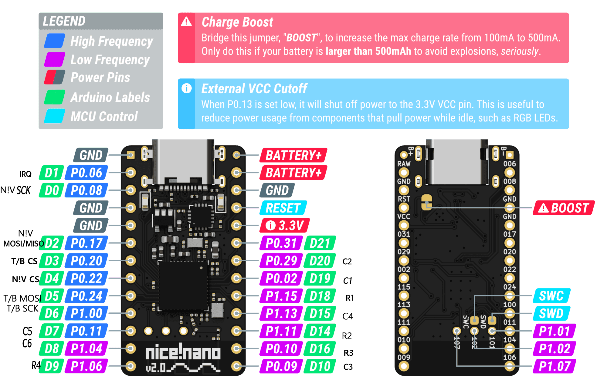  
이제 핸드와이어링을 하기 위한 정보를 전부 취합했으니, 저는 위에 보이는 대로 핀아웃을 구성했습니다.  
제 키보드는 1번열을 안 쓰고, 여기서 1번열은 카리브디스 미니에서 새끼손가락으로 누르는 키보드 최외곽열이라는 점을 명심하세요.  
트랙볼이랑 nice!view 가 쓰는 SCK/MOSI/CS 핀들은 서로 위치를 바꿀 수 있습니다.  
비록 제 핀아웃은 엄청 조잡하게 완성되었지만, 만약 이걸 직접 만들 거라면 좀 정리해서 더 깔끔하게 만드는 것을 권고합니다.  
다만 nice!view 랑 트랙볼 센서는 원할히 작동하기 위해 high-freuquency 핀을 써서 연결하는 게 좋습니다.  

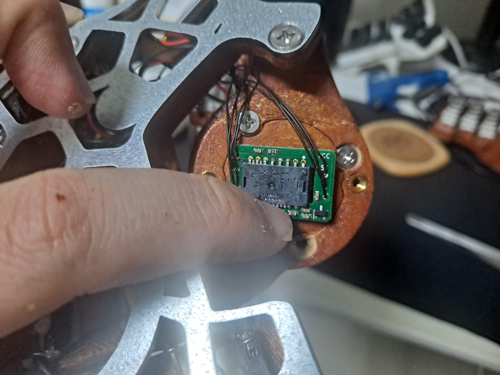  
트랙볼 센서로 저는 [카리브디스용 pmw-3610 보드](https://github.com/Bastardkb/charybdis-pmw3610-breakout) 대신에 [ufan의 원조 pmw-3610 보드를](https://github.com/ufan/pmw3610_breakout) 썼는데, 그 이유는 이게 더 작고, 어차피 JLCPCB에서 최소 주문량인 5개를 주문해야 하니까 나머지 보드를 써서 다른 키보드를 만들고자 했기 때문입니다.  
하지만 이러면 pmw-3610 센서를 정확한 위치에 고정할 방법이 사라지기 때문에 저는 VOID가 만든 트랙볼 센서 어댑터 파일을 개조해서 pmw-3610 센서를 제자리에 고정할 수 있게 만들었습니다.  
결론적으로는 저는 센서 위치를 완벽하게 맞추는 거는 실패했고, 트랙볼 센서 고정 나사를 대충 조금씩 조이는 방식으로 떼웠습니다.  
제 설정대로 트랙볼을 정상적으로 쓰려면 센서는 반드시 위에 보이는 대로 고정되어야 하며, 이게 엄청 쓰기가 힘들기 때문에 그냥 카리브디스용 보드를 쓰는 걸 강력추천합니다.  

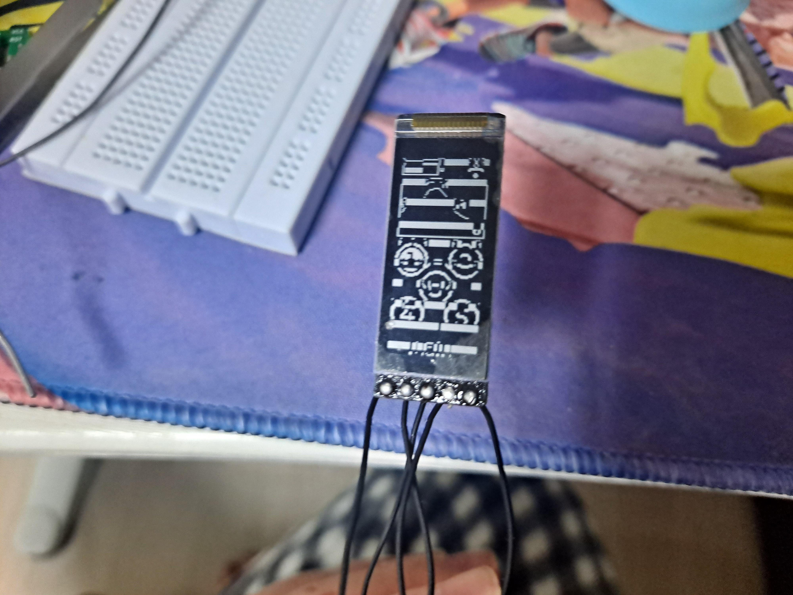  

As far as I know, nobody wired a nice!view to a keyboard with a pointing device on ZMK, so I didn't know how their SPIs would interact, let alone what an SPI even is. 
I first thought they could share the same spi device and wired them to the exact same pins, and the nice!view started malfunctioning as shown in the photo.  
This is a very stupid thing to do in hindsight, but my lack of knowledge prevented me from realizing what an idiot I was.  
Whatever signals sent by the trackball interferred with the nice!view, and now I know they must use different pins.  
I set the trackball to use spi1, the nice!view to use spi3, wired the trackball and nice!view to different pins, and everything worked flawlessly.  
I then tested to see if they just had to use different pins and was able to share the same spi device, but although the nice!view screen showed up normally, the trackball didn't work.  
Maybe there might be an error on my side, but with this, I came to believe that the trackball sensor and nice!view must use both different pins and spi devices.  

## 마무리
With the keyboard now functioning properly, I just had to get keyswitches and keycaps to finish the build.  
I got Gazzew Boba U4 keyswitches as I prefer having no noise, and I got a set of Ogre zinc alloy keycaps to further push the metal-wood aesthetics.  
They feel cold to touch for the first couple minutes, but they'll warm up eventually. Sometimes they make a metallic clank sound when I type, which I think is cool.  
The Ogre keycaps are sold in Korea for roughly $48 for 72 caps, making them far more affordable than aluminum or stainless steel keycaps.  
However, as zinc alloy keycaps are notoriously subseptible to discoloration, I might have to replace them after a couple months or years later.  
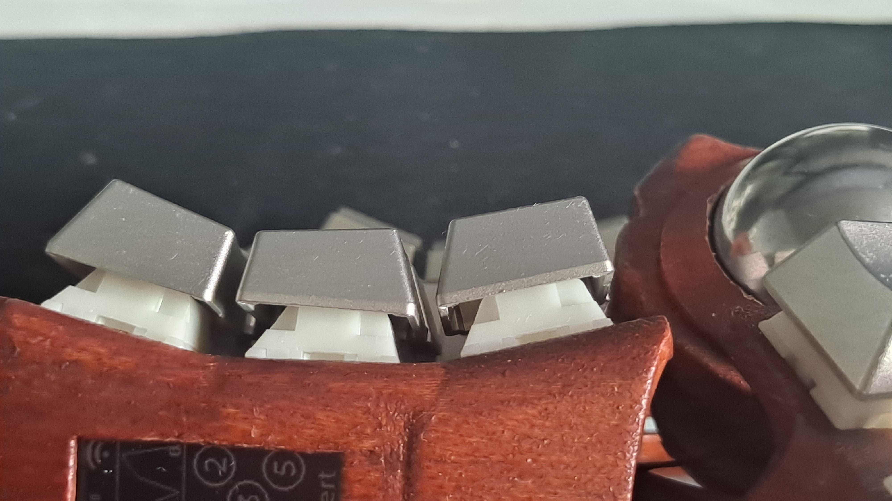  
I've installed the R4 keycaps upside down on row one and R2 and R3 keycaps on rows two and three, thus creating a pseudo-keywell structure.  
It would have been better to use other keycaps, but as these were the only metal keycaps I was willing to afford, I had to make use of what I could.  
The pseudo-keywell had a surprisingly satisfying curvature, although the bottom row felt a bit flat. To me, it is not inferior to uniform DSA keycaps, albeit having strengths and shortcomings in different areas.  
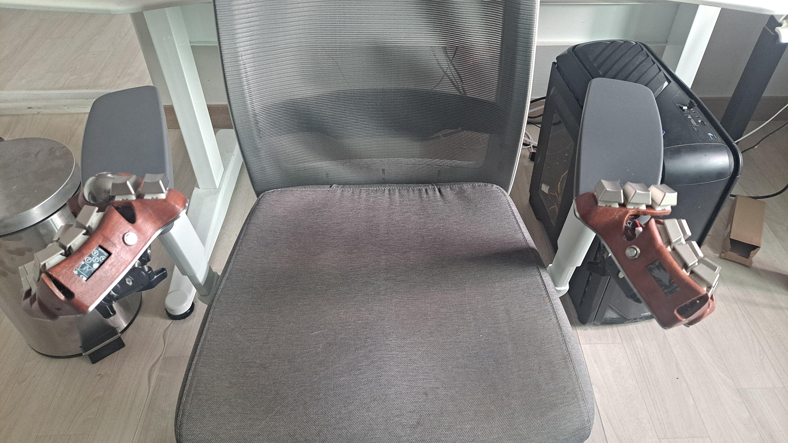  
I mainly use the keyboard clamped to my chair with MagSafe adapters and 141cm magic arms.  
It is very convenient to type with, and the 100mah battery lasts about 5 days.  
When I don't use the keyboard, I detach both halves and place them on the magnetic alien tents as display.    

## 한계점
Now with the keyboard finished, there are some huge flaws that must be fixed.  
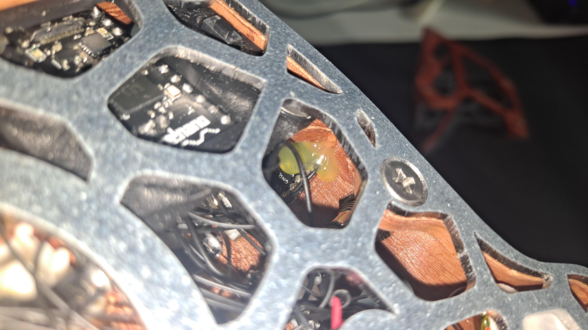    
1. The nice!view must have a non-destructive way to install. I just hotglued mine and they work fine to me, but this is not a reliable way to manufacture a keyboard, and I will have a huge problem replacing them when they eventually break down.  
2. The right half resets sometimes when I detach it from the chair. I believe this is happening due to a short, but it is practically impossible to address as I did a messy job handwiring the keyboard.  
3. My ZMK config is outdated. Whenever I turn off the keyboards, the peripheral left half loses connection to the right half and fails pairing. This was fixed by adding CONFIG_ZMK_BLE_EXPERIMENTAL_CONN=y in charybdis.conf, but it in turn drains the left half's battery extremely fast, so it also only lasts about 5 days and not the expected one month. I can actually fix this easily by using the most recent ZMK pointer branch, so it isn't as critical as the other flaws. 
4. I am using a 3x6 Charybdis Mini firmware instead of a 3x5 Charybdis Nano firmware. Although it is functioning perfectly, I am basically using a 3x6 keymap with all of the outer column keys left blank. It is a bit of a hassle to work with, and it would be much more nice to just set it as a 3x5 keyboard in the first place.  
5. The trackball sensor isn't perfectly aligned to the trackball. As I fastened ufan's breakboard by modifying VOID's pmw-3610 adapter, it is less precisely positioned than the Charybdis pmw-3610 breakboard that is always guaranteed to be in the same height and orientation. Due to this flaw, the track ball sometimes doesn't work, and I have to press on the bottom of the cover and tap it a bit to make it work properly. This can be fixed by modifying VOID's pmw-3610 adapter and the trackball sensor bottom cover, but although I am currently working on it right now, it will take a huge amount of trial and error.  

Because of the reasons listed, I do not recommend building this keyboard the way I did.  
Instead, I'd recommend using flexible PCBs, the Charybdis pmw-3610 breakboard, and not using nice!views for the current time.  
And I would also recommend buying [BastardKB's Charybdis kit](https://bastardkb.com/charybdis) as it's a very nice way to get most of the materials.  
Maybe I will update the 3D files in the future, but I am mentally satisfied with what I have accomplished, and it will take a lot of motivation and learning until I muster up the will to fix them.  
