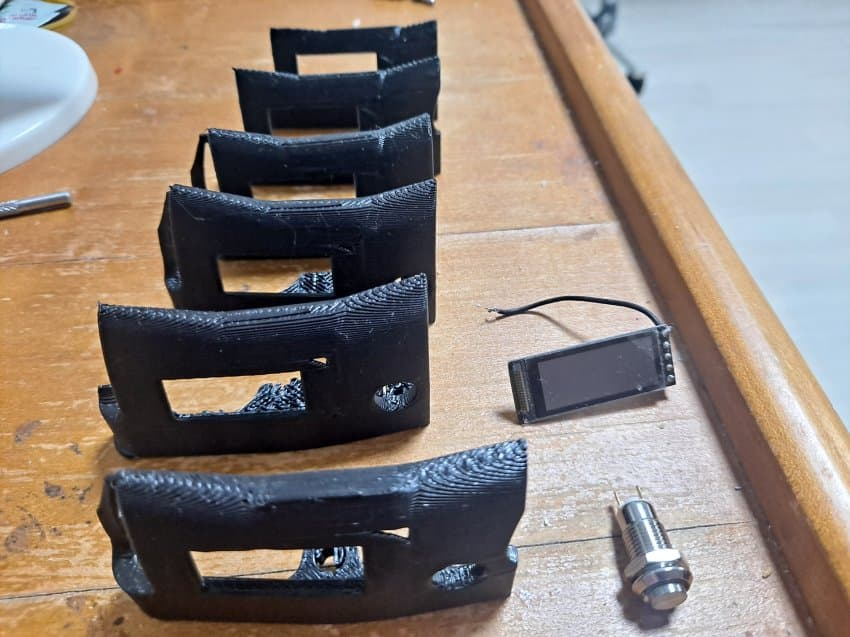
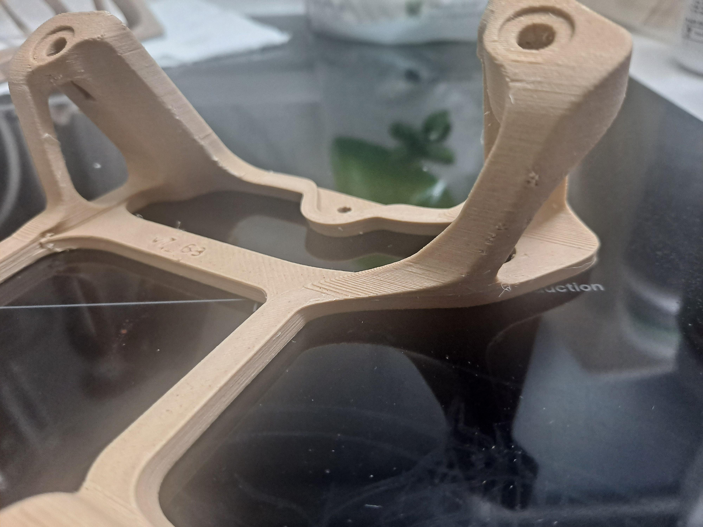
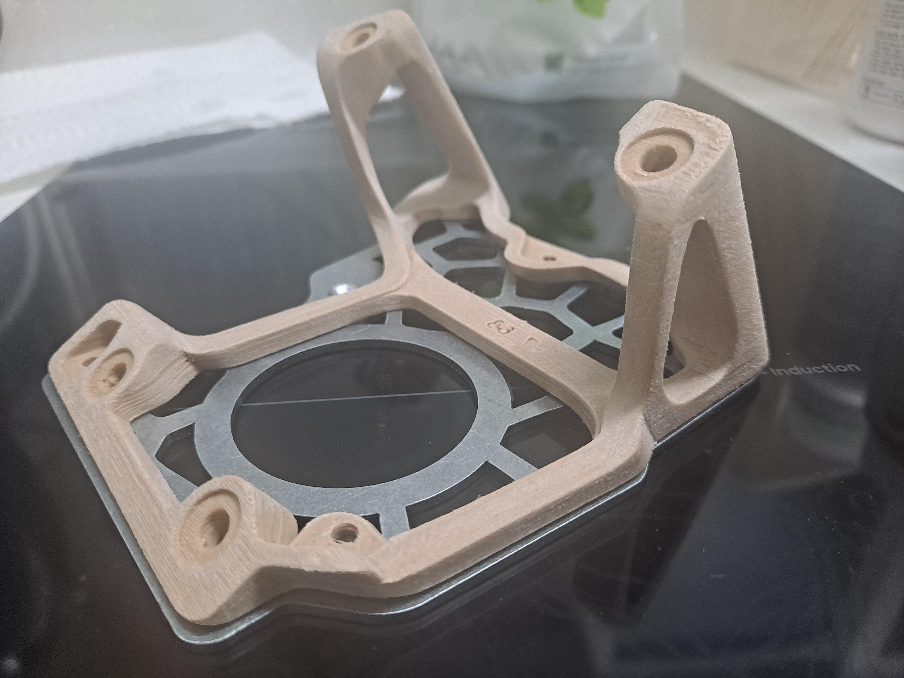
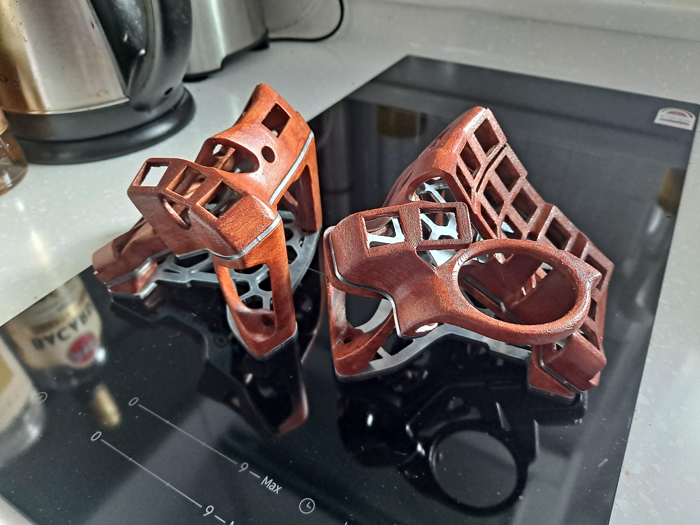
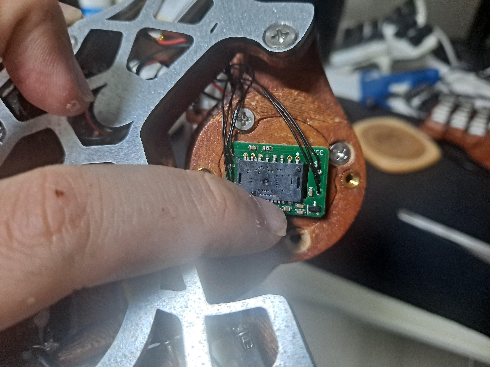
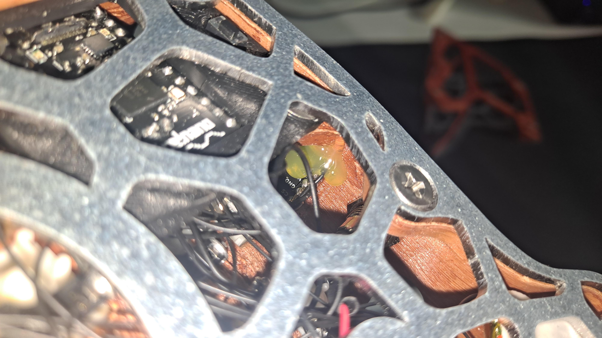

   
## Planning
After being inspired to build this keyboard, the first goal I wanted to achieve was using capacitive touch to automatically switch to mouse layer.  
I knew this was possible as I saw ufan mock up a test build with a stainless steel ball bearing in the ZMK Discord server, so I naturally decided to use one as well.  
With the constraint of having a stainless steel trackball, I thought wood and metal would create an intriguing vintage-furniture-like design.  
  
Regarding functionality, I wanted it to be wireless, have a button switch to save battery, add magnets to the original tents to attach/detach them conveniently and install nice!view displays to know the pairing status and battery level.  
I knew the first two goals were possible, but I've never seen someone using both a trackball and display on the same keyboard as pointing devices are currently experimental on ZMK.  
With these challenges in mind, I proceeded to the building process.

## Modeling
(Photo of model case shot in front)  
I have practically no knowledge in Fusion360, but as the changes I was about to make were minimal, it fortunately didn't deter the process too much.  
Firstly, I just simply added two holes on the side for the button switch and covered up the TRRS hole on the case. I also changed the MCU holder for handwiring so that it didn't hold the TRRS conenector, grabbed on millmax hotswap sockets, and used a 3x6 button switch. 
(tent 3d model)
For the tents, I just had to make some holes, and for the keyboard cases, I just had to make a hole for the button switch and a holder for the nice!view.  
Everything except for the nice!view part was easy, as there was nothing to hold the nice!view.  
So I followed BastardKB's original Charybdis design video(put link) to make some walls on the side the exact way he did, and then I made a rectangular hole big enough to fit the nice!view flush.  
  
If I was better in using Fusion360, I would have added a latch or any other mechanism to hold the nice!view in place. However, as I was limited by the fact that I don't know what I am doing, I simply stopped and decided to glue it in place.  

## Printing, Sanding, and Staining
  
After the modeling process was finished, I 3D printed the cases and tents with wood PLA.  
The reason I used wood PLA was because I wanted the keyboard to feel like actual wood, and I saw some guides online that suggested sanding and staining.  
However, I later learned that just painting regular PLA like wood was way simpler, offered much more control, and achieved better results.  
If I were to rebuild this keyboard the same way, I think I would do that instead.  
  
  
I roughly sanded the printed 3D models with an 80 grit sandpaper to make it absorb the wood stain more easily.  
I could have used 160 or 200 grit sandpaper instead, but I expected the coarse 80 grit sandpaper to shorten the sanding process and produce a more unrefined, natural look opposed to the smooth, layered surface you get 3D printing.  
And I also tried to make the surface as smooth as possible without showing any staircase effects.  
  
  
  
Once the cases and tents were ready, I stained them with two to three coats of some generic wood stain and finished the surface with a matte varnish.  
The final product turned out a bit too bright and red than I intended, but it was acceptable so I moved on.  

## Wiring and Electronics
  
I hand-wired the keyboard because I already had everything I needed to build the keyboard, and I didn't feel the need to order flexible PCBs. I deeply regret this decision as the inner height of the Charybdis Nano is so low that the wire could touch the metal plate and potentially cause shorts. Due to this reason, I strongly recommend using flexible PCBs if you were to build a Charybdis Nano yourself.  
As I have little to no knowledge about electronics, and all I am doing is guesswork based on pre-existing builds. This acted as a major obstacle for handwiring this keyboard as it meant I couldn't just install the firmware and had to figure out which wires were connected to which pin on the MCU. This is another reason why you should use flexible PCBs alongside BastardKB's Elite-C holder or splinktegrated, as everything is pre-positioned. So I dug up VOID's zmk folder to find out how everything had to be wired.  
(photo of row2col and row pinout and such)
Based on -insert file name-, I found three keywords: row2col, pins, and pins.  

(photo of keyboard matrix)  
row2col : This meant electricity flowed from rows to columns for keyboard scanning. It is very important to know this detail, as this indicates which direction we must wire the diodes so that we ensure the electricity doesn't flow the other way around.  
Both the row pins and column pins indicated told me where each row and column must be wired to, so I just had to connect the wires accordingly.  
  
This is my pinout, and the trackball/nice!view SCK/MOSI/CS/IRQ pins each can be interchanged with their corresponding positions. Although I ended up with this seemengly random placement, I believe only the VCC and RST pins must be wired at the same spot and would rather recommend organizing it to be more easily comprehensible. But keep in mind that it is preferred to use high-freuquency pins for the nice!view and trackball sensor.  

  
I used ufan's original pmw-3610 breakboard opposed to the Charybdis pmw-3610 breakboard because it was smaller, and since I am forced to buy 5 of these at least when ordered from JLCPCB, I planned to use the leftover ones for different keyboard projects.  
However, this meant the pmw-3610 doesn't have a way to be positioned correctly, so I had to change VOID's trackball sensor adapter to hold the pmw-3610 in place. I have failed in fine-tuning the position, and I worked around this problem by adjusting how tightly the bottom screws are turned.   
The trackball position must be in the exact configuration shown in the photo to work with my settings, and I strongly recommend using the Charybdis breakboard as it is very finicky to work and hard to callibrate.  

  

As far as I know, nobody wired a nice!view to a keyboard with a pointing device on ZMK, so I didn't know how their SPIs would interact, let alone what an SPI even is. 
I added -corresponding lines- in the config file to make the nice!view work as a native shield, and as result the nice!view started malfunctioning as shown in the photo.  
I believe this happenend because at this point, both the nice!view and trackball's irpt, sck, mosi pins were wired to the same MCU pins, and they were both set to use spi0. It seemed that whatever signals sent by the trackball interferred with the nice!view.  
To solve this issue, I set the trackball to use spi1, the nice!view to use spi3, wired the trackball and nice!view to different pins, and everything worked flawlessly.  
I then tested to see if they just had to use different pins and was able to share the same spi device, but although the nice!view screen showed up normally, the trackball didn't work.  
Maybe there might be an error on my side, but with this, I came to believe that the trackball sensor and nice!view must use both different pins and spi devices.  

## Final Stretch
With the keyboard now functioning properly, I just had to get keyswitches and keycaps to finish the build.  
I got gazzew Boba U4 keyswitches as I prefer having no noise, and I got a set of Ogre zinc alloy keycaps to further push the metal-wood aesthetics. They feel cold to touch for the first couple minutes, but they'll warm up eventually. Sometimes they make a metallic clank sound when I type, which I think is cool.    
The Ogre keycaps are sold in Korea for roughly $48 for 72 caps, making them far more affordable than aluminum or stainless steel keycaps. However, as zinc alloy keycaps are notoriously subseptible to discoloration, I might have to replace them after a couple months or years later.  
  
I've installed the R4 keycaps upside down in row one and R2 and R3 keycaps in rows two and three, thus creating a pseudo-keywell structure. It would have been better to use other keycaps, but as these were the only metal keycaps I were willing to afford, I had to make use of what I could.  
The pseudo-keywell had a surprisingly satisfying curvature, although the bottom row felt a bit flat. To me, it is not inferior to uniform DSA keycaps, albeit having strengths and shortcomings in different areas.  
  
I am currently mainly using the keyboard clamped to my chair with Magsafe adapters and 141cm magic arms. It is very convenient to type, and the battery lasts about 5 days. When I don't use the keyboard, I detach both halves and place them on the magnetic alien tents as display.    

## Limitations
Now with the keyboard finished, there are some huge flaws that must be fixed.  
    
Firstly, the nice!view must have a non-destructive way to install. I just hotglued mine and they work fine to me, but this is not a reliable way to manufacture a keyboard, and I will be greatly limited in means to fix them when they eventually break down.  
Secondly, the right half resets sometimes when I detach it from the chair. I believe this is happening due to a short, but it is practically impossible to address as I did a messy job handwiring the keyboard.  
Thirdly, my ZMK firmware is outdated. Whenever I turn off the keyboards, the peripheral left half loses connection to the right half and fails pairing. This is fixed by changing the config file a bit, but it in turns drains the left half's battery extremely fast, so it also only lasts about 5 days and not the expected one month. I can actually fix this easily by using the most recent ZMK pointer branch, so it isn't as critical as the other flaws. 
Lastly, the trackball sensor isn't perfectly aligned to the trackball. As I fastened ufan's breakboard by modyfying VOID's pmw-3610 adapter, it is less precisely positioned than the Charybdis pmw-3610 breakboard that is always guaranteed to be in the same height and orientation. Due to this flaw, the track ball sometimes doesn't work, and I have to press on the bottom of the cover and tap it a bit to make it work properly. This can be fixed by modifying VOID's pmw-3610 adapter and bottom cover, but although I am currently working on it right now, it will take a huge amount of trial and error.  

Because of the reasons listed, I do not recommend building this keyboard the way I did.  
Instead, I'd recommend using flexible PCBs, the Charybdis pmw-3610 breakboard, and not using nice!views for the current time.  
Maybe I will update the 3D files in the future, but I am mentally satisfied with what I have accomplished, and it will take a lot of motivation and learning until I muster up the will to fix them.  
