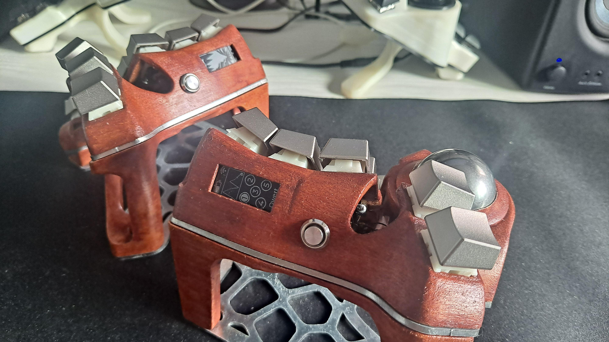
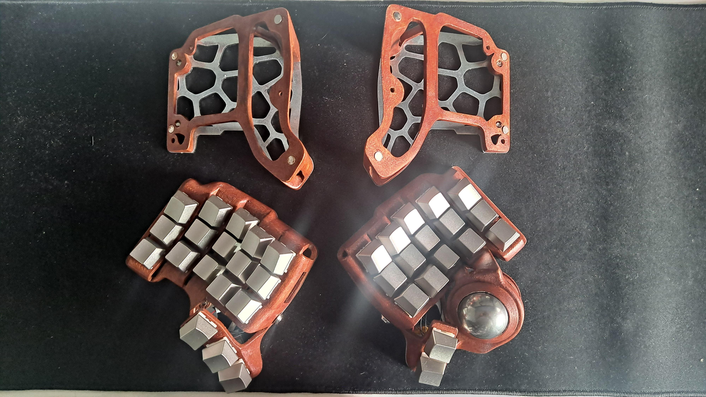

# Charybdis Nano Buildlog
This is my rendition of the Charybdis Nano split keyboard made by [BastardKB.](https://github.com/bastardkb/charybdis)  
  
  
  
  
  
Intended to be a wireless-only build, I removed the TRRS jack on both cases, added walls to support a nice!view, and made holes to fit a metal on/off switch.  
I used the trackball cover mod to prevent the stainless steel ball from dropping out when I take it off the tent or MagSafe adapter.    
The alien tents have magnets imbedded, making it easier to attach and detach the keyboards.  
With 110mah batteries, I can use the fully charged keyboard for about 5 days before recharging.  
You can see a detailed buildlog in the Buildlog folder.  

## Materials
- Case: CooBean Wood PLA Filament, sanded, stained with generic mahogani wood stain and varnish
- Switches: Gazzew Boba U4
- Keycaps: Ogre Zinc Alloy OEM Keycaps (Korean Local Seller)
- Plates: Laserboost Galvanized Steel Plates
- Chair Attachment: Ulanzi R094 Magic Arm & Clamp + MagSafe Adapters
  
## Electronics    
- MCU: nice!nano 2.0
- Trackball Sensor: [ufan's original PMW3610 breakboard](https://github.com/ufan/pmw3610_breakout)
- Display: nice!view  
