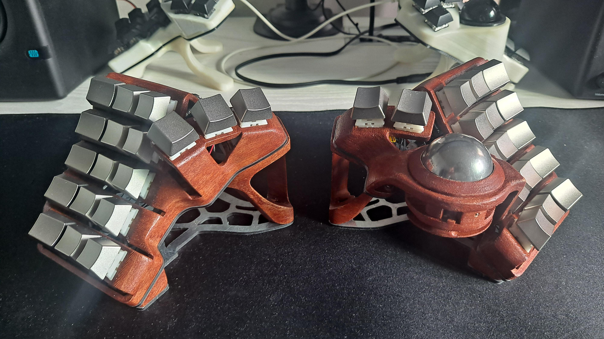

# Charybdis Nano Buildlog
This is my rendition of the Charybdis Nano split keyboard made by [BastardKB.](https://github.com/bastardkb/charybdis)  
  
  
  
  
  
Intended to be a wireless-only build, I removed the TRRS jack on both cases, added walls to support a nice!view, and made holes to fit a metal on/off switch.  
I used the trackball cover mod to prevent the stainless steel ball from dropping out and causing freak accidents.  
The alien tents have two 3x6 magnets each embedded in the tall legs and one 2x6 magnet each in the short legs to attach the keyboards.   
You can see a detailed buildlog in the Buildlog folder.  

## Materials
- Case: CooBean Wood PLA Filament, sanded, stained with generic mahogani wood stain and varnish
- Switches: Gazzew Boba U4
- Keycaps: Ogre Zinc Alloy OEM Keycaps (Korean Local Seller)
- Plates: Laserboost Galvanized Steel Plates
- Chair Attachment: Ulanzi R094 Magic Arm & Clamp + Magsafe Adapters
  
## Electronics    
- MCU: nice!nano 2.0
- Trackball Sensor: [ufan's original PMW3610 breakboard](https://github.com/ufan/pmw3610_breakout)
- Display: nice!view  
